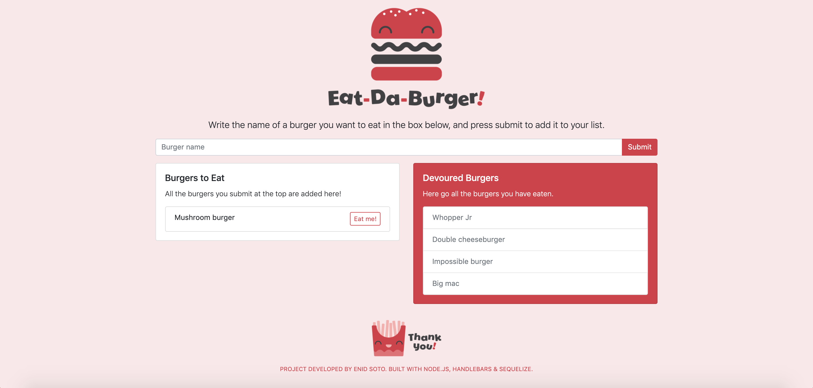

# Logger App

***Developed by Enid Soto***

This is a simple burger logger application that allows users to submit burgers they want to try, and mark them as eaten. 

## Purpose

This project was created to practice skills learned in the UM Full Stack Developer Bootcamp 2019-2020. The goal was to build a full-stack application that follows the MVC pattern.

## Technologies used

The back-end was built with Node.js and Express. For the data: Sequelize, mySQL2, MAMP and MySQLWorkbench were used. The front-end was built with Handlebars, jQuery and Bootstrap 4.

## Functionality

1. When the page loads, a query is sent to the database to check if there are any burgers stored. If there are, the corresponding lists are populated with the information. The left panel holds the uneaten burgers, and the right panel holds the eaten burgers.
2. At the top, users can type a burger they would like to try in the input field. When "submit" is pressed, the burger is stored in the database and it is added to the left side panel ("Burgers to Eat").
3. Each burger entry in the "Burgers to Eat" panel will have an "Eat me!" button. When this button is pressed, the burger data will be updated in the database to reflect it has been eaten, and the burger information will be moved to the right side panel ("Devoured Burgers").

## User interface

## Link to the deployed application

You can find the deployed application [here](https://rhubarb-custard-87535.herokuapp.com/)